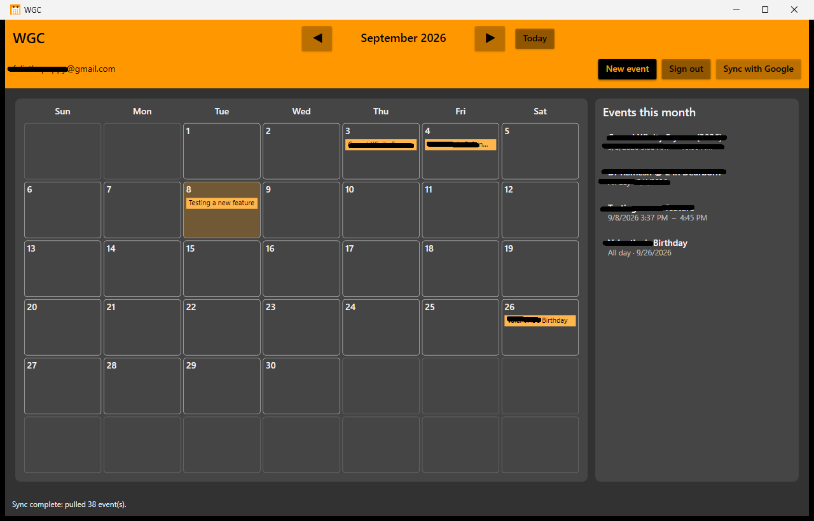
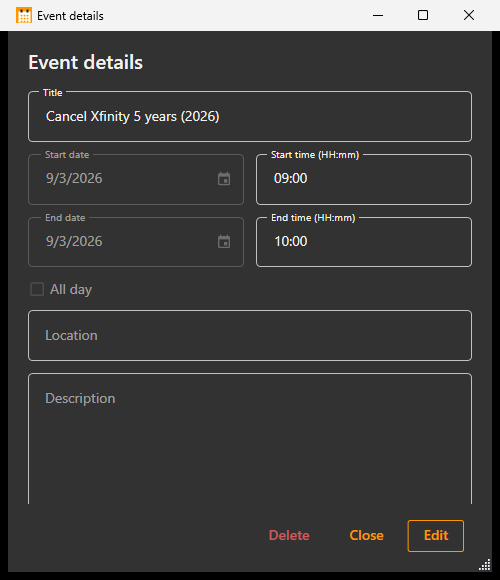
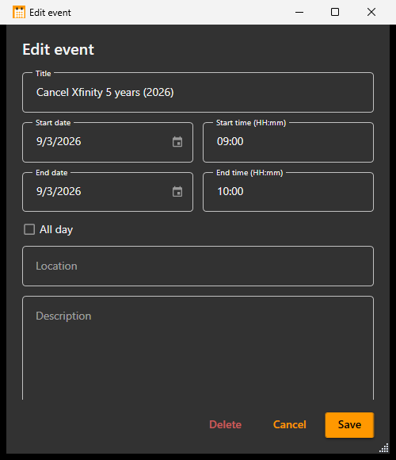
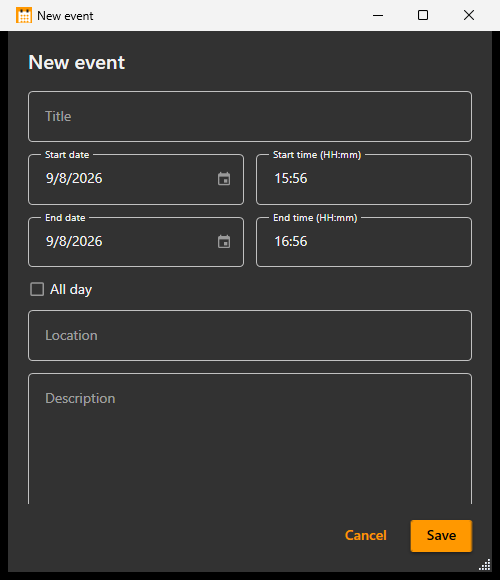

# WGC (Windows Google Calendar)

Native Windows desktop calendar with two-way **Google Calendar** sync, toast reminders, and tray background mode.

Built with **WPF** (.NET 9), **Material Design**, **SQLite**, and the **Google Calendar API**.

---

## Screenshots

### Main calendar
Month grid, event list, Google account status, and sync controls.



### Event details (read-only)
Click an event to review everything without editing. Use **Edit**, **Delete**, or **Close**.



### Edit event
After **Edit**, fields become writable. Save pushes to Google when signed in.



### New event
Create a timed or all-day event with title, location, and description.



---

## Features

### Calendar
- Month grid with up to 3 event chips per day
- Side list of events for the visible month
- Create, edit, and delete events (dialog)
- Double-click a day to create; click an event to view details
- All-day and timed events, plus location and description
- Polymorphic dialog modes: **view** (read-only) → **Edit** → **Save**

### Google Calendar sync
- Sign in with Google (Desktop OAuth)
- **Push**: local create / update / delete syncs to Google when signed in
- **Pull**: imports Google events and updates local copies
- **Auto-sync** on startup, every **5 minutes**, and when the window is focused
- Removes local events that were deleted in Google Calendar
- **Advanced Google setup** only appears if OAuth is not already configured

### Reminders & background
- Windows **toast notification** ~**15 minutes** before a timed event starts
- Reminder-style toasts stay visible until dismissed
- Closing the main window **does not quit** — the app stays in the **notification area (tray)** so reminders and sync keep running
- Tray: double-click or **Open WGC** to restore; **Exit** to quit for real

### App polish
- Dark + orange Material Design UI
- Local SQLite storage and rolling logs under `%LocalAppData%\WGC`
- Versioned Release packaging via `scripts/publish.ps1`

---

## Requirements

- Windows 10/11 (x64)
- [.NET 9 SDK](https://dotnet.microsoft.com/download/dotnet/9.0) (to build)
- A Google Cloud project with:
  - **Google Calendar API** enabled
  - OAuth client type **Desktop app** (not Web)

---

## Quick start (development)

```powershell
cd "E:\Coding and Development\Bot\DotNetApp"
dotnet restore WGC.sln
dotnet run --project CalendarDesktop\CalendarDesktop.csproj
```

Or open `WGC.sln` in Visual Studio and press F5.

### First-time Google setup (dev)

1. In [Google Cloud Console](https://console.cloud.google.com/):
   - Enable **Google Calendar API**
   - Create OAuth client → Application type: **Desktop app**
   - Copy **Client ID** and **Client Secret**
2. In the app, if OAuth is not embedded yet, use **Advanced Google setup** and paste those values.
3. Click **Sign in with Google** and finish the browser consent flow.
4. If the consent screen is **Testing**, add your Gmail as a test user.

Credentials are stored at:

`%LocalAppData%\WGC\google-oauth.json`

---

## Using the app

| Action | How |
|---|---|
| Change month | ◀ / ▶ or **Today** |
| New event | **New event**, or double-click a day |
| View event details | Click an event in the list or a day chip |
| Edit event | Open details → **Edit** → **Save** |
| Delete event | From details or edit → **Delete** |
| Connect Google | **Sign in with Google** |
| Sign out | Button becomes **Sign out** when connected |
| Force sync | **Sync with Google** |
| Hide to tray | Close the window (X) |
| Open from tray | Double-click tray icon, or right-click → **Open WGC** |
| Quit completely | Tray → right-click → **Exit** |

### Sync behavior (when signed in)

- Creating or editing an event **pushes** it to Google immediately
- Deleting an event removes it from Google when possible
- Auto-sync **pulls** changes from Google (including deletions)
- Footer status shows sync progress and results

### Reminders

- While the app is running (window open **or** in the tray), timed events get a toast ~15 minutes before start
- All-day events do **not** trigger toast reminders
- Each event is notified once per start time (no spam if the checker runs again)

---

## Project layout

```
DotNetApp/
├── WGC.sln
├── CalendarDesktop/                 # WPF app (assembly: WGC.exe)
│   ├── Assets/app.ico
│   ├── Services/
│   │   ├── EventService.cs
│   │   ├── GoogleCalendarService.cs
│   │   ├── EventReminderService.cs  # Toast reminders
│   │   ├── TrayIconService.cs       # Notification-area icon
│   │   └── AppLog.cs
│   ├── Data/                        # EF Core + SQLite
│   ├── Models/
│   ├── MainWindow.xaml
│   ├── EventDialog.xaml
│   └── GoogleSetupWindow.xaml
├── docs/
│   └── screenshots/                 # README screenshots
├── scripts/
│   ├── publish.ps1                  # Release package builder
│   └── WGC.iss                      # Optional Inno Setup installer
├── artifacts/                       # Publish output (generated, gitignored)
├── PRODUCTION.md                    # Production checklist & details
├── README.md
└── archive/                         # Older web / WebView experiments
```

---

## Configuration

### Bundled settings

`CalendarDesktop/appsettings.json` ships empty in source:

```json
{
  "GoogleCalendar": {
    "ClientId": "",
    "ClientSecret": ""
  }
}
```

Load order at runtime:

1. Bundled `appsettings.json` next to the EXE (preferred for production builds)
2. `%LocalAppData%\WGC\credentials.json` (Google Desktop download)
3. `%LocalAppData%\WGC\google-oauth.json` (Advanced setup)

Do **not** commit real Client secrets to git.

### Local data

| Path | Purpose |
|---|---|
| `%LocalAppData%\WGC\wgc.db` | Local events + connection state |
| `%LocalAppData%\WGC\GoogleAuth\` | OAuth tokens |
| `%LocalAppData%\WGC\logs\` | Rolling Serilog logs |
| `%LocalAppData%\WGC\google-oauth.json` | Dev / override OAuth client |

On first launch after the rename, data is migrated automatically from the legacy `%LocalAppData%\CalendarApp` folder if present.

---

## Production build

From the repo root:

```powershell
.\scripts\publish.ps1
```

This will:

1. Publish a **self-contained** `win-x64` single-file Release build
2. Embed OAuth from your local `google-oauth.json` into the package
3. Create:
   - `artifacts\WGC-1.0.0-win-x64\`
   - `artifacts\WGC-1.0.0-win-x64.zip`

End users unzip (or install), run `WGC.exe`, and click **Sign in with Google** — no setup dialog when OAuth is embedded.

### Optional installer

1. Run `.\scripts\publish.ps1`
2. Compile `scripts\WGC.iss` with [Inno Setup](https://jrsoftware.org/isinfo.php)

### Optional Authenticode signing

This is a **Windows code-signing certificate** thumbprint, not an OAuth value:

```powershell
$env:WGC_SIGN_THUMBPRINT = "YOUR_CERT_SHA1_THUMBPRINT"
.\scripts\publish.ps1
```

Find the thumbprint in `certmgr.msc` → Personal → Certificates → Details → Thumbprint, or:

```powershell
Get-ChildItem Cert:\CurrentUser\My | Where-Object { $_.HasPrivateKey } |
  Format-List Subject, Thumbprint, NotAfter
```

Without signing, Windows may show an “unknown publisher” / SmartScreen warning.

### Google Cloud for other users

| Audience | Consent screen |
|---|---|
| Just you / small team | Keep **Testing** and add test users |
| Public / many users | Set status to **In production** (verification may be required for Calendar scopes) |

Keep the OAuth client type as **Desktop app**.

More detail: [PRODUCTION.md](PRODUCTION.md)

---

## Troubleshooting

| Symptom | What to check |
|---|---|
| “This app’s request is invalid” | OAuth client must be **Desktop app**, not Web |
| Sign-in works for you but not others | Consent screen still **Testing** — add them as test users or publish |
| Events don’t appear in Google | Confirm status shows your email (signed in); check footer / logs |
| Deleted Google events still show | Wait for auto-sync, click **Sync with Google**, or restore from tray and sync |
| No toast reminder | App must be running (window or tray); event must be timed (not all-day); start within ~15 minutes |
| Closed the window and can’t find the app | Check the notification area (system tray); double-click the WGC icon |
| Want to quit completely | Tray → right-click → **Exit** |
| Crash / sync errors | `%LocalAppData%\WGC\logs\` |

---

## Tech stack

- .NET 9 / WPF (+ Windows Forms NotifyIcon for tray)
- MaterialDesignThemes
- Entity Framework Core + SQLite
- Google.Apis.Calendar.v3 + Google.Apis.Auth
- Microsoft.Toolkit.Uwp.Notifications (toasts)
- Serilog

---

## License

Private project — add a license here if you distribute it.
